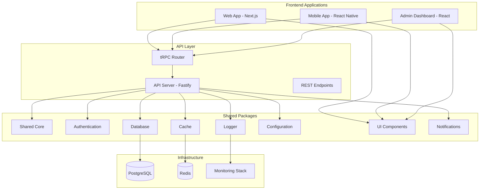
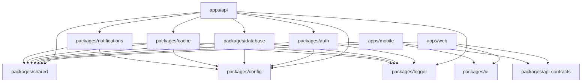
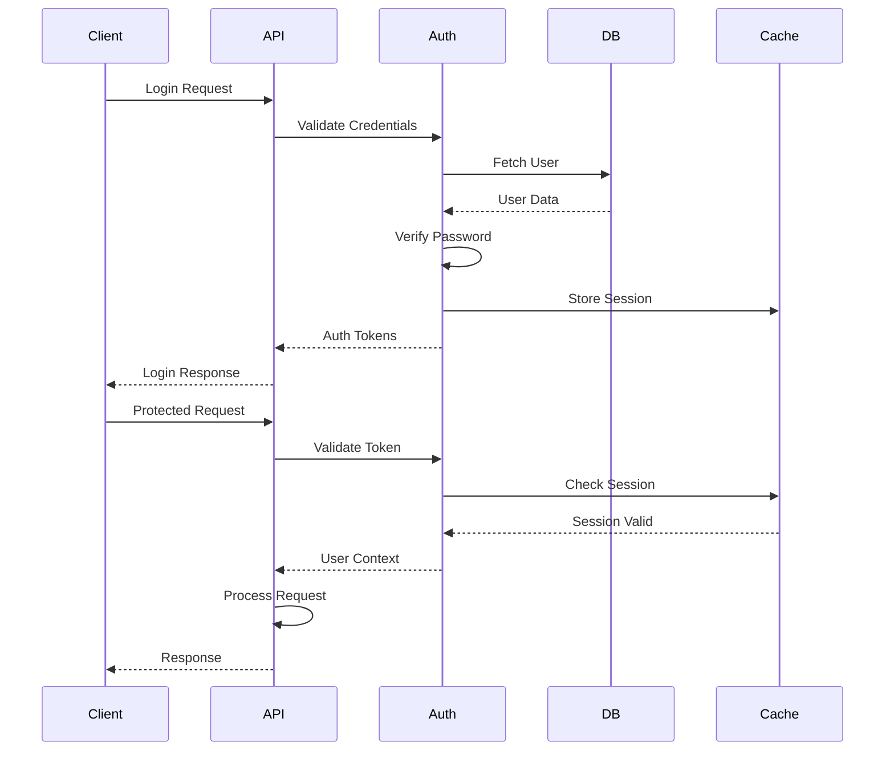

# Fullstack Monolith Transformation - Design Document

## Overview

This design document outlines the complete architectural transformation of the existing Node.js authentication API into a comprehensive fullstack monolith. The transformation will create a modern, scalable, and maintainable architecture that supports web, mobile, and API applications while sharing common business logic through well-designed packages.

The design follows enterprise-grade patterns including Clean Architecture, Domain-Driven Design, and modern DevOps practices to ensure the resulting system is production-ready and capable of scaling to meet future requirements.

## Architecture

### High-Level Architecture



### Workspace Structure Design

The monorepo will be organized into four main directories:

1. **apps/**: Application-specific code (web, mobile, api, admin)
2. **packages/**: Shared libraries and utilities
3. **tools/**: Development tools, scripts, and generators
4. **infrastructure/**: Deployment and infrastructure configurations

### Package Dependency Graph



## Components and Interfaces

### Core Shared Package (packages/shared)

**Purpose**: Contains domain entities, value objects, shared types, and utilities that are used across all applications.

**Key Components**:

- Domain entities (User, Session, AuthToken, etc.)
- Value objects (Email, Password, PhoneNumber, etc.)
- Shared TypeScript types and interfaces
- Common utility functions
- Application constants and enums
- Validation schemas using Zod

**Interface Design**:

```typescript
// packages/shared/src/entities/User.ts
export class User extends Entity {
  constructor(
    public readonly id: UserId,
    public readonly email: Email,
    public readonly profile: UserProfile,
    public readonly createdAt: Date,
    public readonly updatedAt: Date
  ) {}

  public updateProfile(profile: UserProfile): User {
    return new User(this.id, this.email, profile, this.createdAt, new Date());
  }
}

// packages/shared/src/types/api.types.ts
export interface ApiResponse<T> {
  success: boolean;
  data?: T;
  error?: ApiError;
  meta?: ResponseMeta;
}
```

### Database Package (packages/database)

**Purpose**: Provides unified database access layer supporting both Prisma and Drizzle ORMs with the same PostgreSQL database.

**Key Components**:

- Database client factory
- Repository interfaces and implementations
- Migration scripts for both ORMs
- Seed data and seeding utilities
- Database schema definitions
- Connection management and pooling

**Interface Design**:

```typescript
// packages/database/src/repositories/interfaces/IUserRepository.ts
export interface IUserRepository {
  findById(id: UserId): Promise<User | null>;
  findByEmail(email: Email): Promise<User | null>;
  create(user: CreateUserData): Promise<User>;
  update(id: UserId, data: UpdateUserData): Promise<User>;
  delete(id: UserId): Promise<void>;
}

// packages/database/src/client.ts
export class DatabaseClientFactory {
  static createPrismaClient(): PrismaClient;
  static createDrizzleClient(): DrizzleClient;
  static getRepository<T>(type: RepositoryType): T;
}
```

### Authentication Package (packages/auth)

**Purpose**: Handles all authentication and authorization concerns including JWT, OAuth, MFA, and WebAuthn.

**Key Components**:

- Authentication strategies (JWT, OAuth, SAML, LDAP)
- Multi-factor authentication (TOTP, SMS, Email)
- WebAuthn implementation
- Role-based access control (RBAC)
- Session management
- Password hashing and validation
- Authentication middleware and guards

**Interface Design**:

```typescript
// packages/auth/src/services/AuthService.ts
export interface IAuthService {
  authenticate(credentials: LoginCredentials): Promise<AuthResult>;
  generateTokens(user: User): Promise<TokenPair>;
  validateToken(token: string): Promise<TokenValidationResult>;
  refreshTokens(refreshToken: string): Promise<TokenPair>;
  logout(userId: UserId, sessionId?: string): Promise<void>;
}

// packages/auth/src/strategies/jwt/JwtStrategy.ts
export class JwtStrategy implements AuthStrategy {
  async validate(token: string): Promise<User | null>;
  async sign(payload: JwtPayload): Promise<string>;
  async verify(token: string): Promise<JwtPayload>;
}
```

### Configuration Package (packages/config)

**Purpose**: Manages environment variables, application configuration, and feature flags across all applications.

**Key Components**:

- Environment variable validation using Zod
- Database configuration
- Cache configuration
- Security configuration
- Feature flag management
- Secret management integration

**Interface Design**:

```typescript
// packages/config/src/env.ts
export const envSchema = z.object({
  NODE_ENV: z.enum(["development", "staging", "production"]),
  DATABASE_URL: z.string().url(),
  REDIS_URL: z.string().url(),
  JWT_SECRET: z.string().min(32),
  // ... other environment variables
});

export type Environment = z.infer<typeof envSchema>;
export const env = envSchema.parse(process.env);
```

### UI Component Library (packages/ui)

**Purpose**: Provides reusable UI components with consistent design system for web and mobile applications.

**Key Components**:

- Base components (Button, Input, Card, Modal, etc.)
- Form components with validation
- Layout components
- Theme configuration
- Accessibility utilities
- Storybook documentation

**Interface Design**:

```typescript
// packages/ui/src/components/Button.tsx
export interface ButtonProps {
  variant: "primary" | "secondary" | "danger" | "ghost";
  size: "sm" | "md" | "lg";
  loading?: boolean;
  disabled?: boolean;
  children: React.ReactNode;
  onClick?: () => void;
}

export const Button: React.FC<ButtonProps> = ({ variant, size, ...props }) => {
  // Implementation with class-variance-authority for styling
};
```

### API Contracts Package (packages/api-contracts)

**Purpose**: Defines type-safe API contracts using tRPC for communication between frontend and backend.

**Key Components**:

- tRPC router definitions
- Input/output validation schemas
- Generated TypeScript types
- Error handling definitions
- API documentation generation

**Interface Design**:

```typescript
// packages/api-contracts/src/routers/auth.ts
export const authRouter = t.router({
  login: t.procedure
    .input(loginSchema)
    .output(authResponseSchema)
    .mutation(async ({ input }) => {
      // Implementation handled by API
    }),

  register: t.procedure
    .input(registerSchema)
    .output(authResponseSchema)
    .mutation(async ({ input }) => {
      // Implementation handled by API
    }),
});
```

## Data Models

### User Domain Model

```typescript
// Core User entity with all authentication-related data
interface User {
  id: UserId;
  email: Email;
  profile: UserProfile;
  security: SecuritySettings;
  preferences: UserPreferences;
  sessions: UserSession[];
  createdAt: Date;
  updatedAt: Date;
}

interface UserProfile {
  firstName: string;
  lastName: string;
  avatar?: string;
  phoneNumber?: PhoneNumber;
  timezone: string;
  locale: string;
}

interface SecuritySettings {
  mfaEnabled: boolean;
  mfaMethods: MfaMethod[];
  passwordLastChanged: Date;
  loginAttempts: LoginAttempt[];
  trustedDevices: TrustedDevice[];
}
```

### Authentication Model

```typescript
interface AuthSession {
  id: SessionId;
  userId: UserId;
  deviceInfo: DeviceInfo;
  ipAddress: string;
  userAgent: string;
  isActive: boolean;
  expiresAt: Date;
  createdAt: Date;
}

interface AuthToken {
  accessToken: string;
  refreshToken: string;
  tokenType: "Bearer";
  expiresIn: number;
  scope: string[];
}
```

### Database Schema Design

The database will support both Prisma and Drizzle ORMs with the same underlying PostgreSQL schema:

```sql
-- Core user table
CREATE TABLE users (
  id UUID PRIMARY KEY DEFAULT gen_random_uuid(),
  email VARCHAR(255) UNIQUE NOT NULL,
  password_hash VARCHAR(255),
  first_name VARCHAR(100),
  last_name VARCHAR(100),
  avatar_url TEXT,
  phone_number VARCHAR(20),
  timezone VARCHAR(50) DEFAULT 'UTC',
  locale VARCHAR(10) DEFAULT 'en',
  email_verified BOOLEAN DEFAULT FALSE,
  phone_verified BOOLEAN DEFAULT FALSE,
  mfa_enabled BOOLEAN DEFAULT FALSE,
  status VARCHAR(20) DEFAULT 'active',
  created_at TIMESTAMP WITH TIME ZONE DEFAULT NOW(),
  updated_at TIMESTAMP WITH TIME ZONE DEFAULT NOW()
);

-- Authentication sessions
CREATE TABLE user_sessions (
  id UUID PRIMARY KEY DEFAULT gen_random_uuid(),
  user_id UUID NOT NULL REFERENCES users(id) ON DELETE CASCADE,
  device_fingerprint VARCHAR(255),
  ip_address INET,
  user_agent TEXT,
  is_active BOOLEAN DEFAULT TRUE,
  expires_at TIMESTAMP WITH TIME ZONE NOT NULL,
  created_at TIMESTAMP WITH TIME ZONE DEFAULT NOW(),
  last_accessed_at TIMESTAMP WITH TIME ZONE DEFAULT NOW()
);

-- MFA configurations
CREATE TABLE user_mfa_methods (
  id UUID PRIMARY KEY DEFAULT gen_random_uuid(),
  user_id UUID NOT NULL REFERENCES users(id) ON DELETE CASCADE,
  method_type VARCHAR(20) NOT NULL, -- 'totp', 'sms', 'email', 'webauthn'
  method_data JSONB NOT NULL,
  is_primary BOOLEAN DEFAULT FALSE,
  is_verified BOOLEAN DEFAULT FALSE,
  created_at TIMESTAMP WITH TIME ZONE DEFAULT NOW()
);
```

## Error Handling

### Error Hierarchy

```typescript
// Base error classes
abstract class DomainError extends Error {
  abstract readonly code: string;
  abstract readonly statusCode: number;
}

class AuthenticationError extends DomainError {
  readonly code = "AUTHENTICATION_FAILED";
  readonly statusCode = 401;
}

class AuthorizationError extends DomainError {
  readonly code = "AUTHORIZATION_FAILED";
  readonly statusCode = 403;
}

class ValidationError extends DomainError {
  readonly code = "VALIDATION_FAILED";
  readonly statusCode = 400;
  constructor(public readonly field: string, message: string) {
    super(message);
  }
}
```

### Error Response Format

```typescript
interface ApiErrorResponse {
  success: false;
  error: {
    code: string;
    message: string;
    details?: Record<string, any>;
    timestamp: string;
    requestId: string;
  };
}
```

## Testing Strategy

### Testing Pyramid

1. **Unit Tests (70%)**:

   - Test individual functions and classes
   - Mock external dependencies
   - Fast execution (< 1ms per test)
   - Coverage target: >90%

2. **Integration Tests (20%)**:

   - Test package interactions
   - Test database operations
   - Test API endpoints
   - Use test database

3. **End-to-End Tests (10%)**:
   - Test complete user workflows
   - Test across web and mobile apps
   - Use Playwright for web, Detox for mobile

### Test Configuration

```typescript
// jest.config.js (workspace root)
module.exports = {
  projects: [
    "<rootDir>/packages/*/jest.config.js",
    "<rootDir>/apps/*/jest.config.js",
  ],
  collectCoverageFrom: [
    "src/**/*.{ts,tsx}",
    "!src/**/*.d.ts",
    "!src/**/*.stories.{ts,tsx}",
  ],
  coverageThreshold: {
    global: {
      branches: 90,
      functions: 90,
      lines: 90,
      statements: 90,
    },
  },
};
```

## Security Architecture

### Authentication Flow



### Security Layers

1. **Transport Security**: HTTPS/TLS 1.3
2. **Authentication**: JWT with refresh tokens
3. **Authorization**: RBAC with fine-grained permissions
4. **Input Validation**: Zod schemas at API boundaries
5. **Rate Limiting**: Redis-based rate limiting
6. **CSRF Protection**: SameSite cookies and CSRF tokens
7. **XSS Protection**: Content Security Policy headers
8. **SQL Injection**: Parameterized queries via ORMs

## Performance Considerations

### Caching Strategy

```typescript
// Multi-layer caching approach
interface CacheStrategy {
  // L1: In-memory cache (fastest)
  memory: MemoryCache;

  // L2: Redis cache (shared across instances)
  redis: RedisCache;

  // L3: Database query optimization
  database: QueryCache;
}

// Cache invalidation patterns
enum InvalidationStrategy {
  TTL = "time-to-live",
  TAG = "tag-based",
  EVENT = "event-driven",
  MANUAL = "manual",
}
```

### Database Optimization

1. **Connection Pooling**: Optimized pool sizes for each environment
2. **Query Optimization**: Automated query analysis and indexing
3. **Read Replicas**: Separate read/write operations
4. **Partitioning**: Table partitioning for large datasets

### Frontend Performance

1. **Code Splitting**: Route-based and component-based splitting
2. **Lazy Loading**: Defer non-critical resources
3. **Image Optimization**: Next.js Image component with WebP
4. **Bundle Analysis**: Webpack Bundle Analyzer integration

## Deployment Architecture

### Container Strategy

```dockerfile
# Multi-stage build for production optimization
FROM node:18-alpine AS base
WORKDIR /app
COPY package*.json ./
RUN npm ci --only=production

FROM base AS build
COPY . .
RUN npm run build

FROM node:18-alpine AS runtime
WORKDIR /app
COPY --from=base /app/node_modules ./node_modules
COPY --from=build /app/dist ./dist
EXPOSE 3000
CMD ["node", "dist/index.js"]
```

### Kubernetes Deployment

```yaml
# API deployment with horizontal pod autoscaling
apiVersion: apps/v1
kind: Deployment
metadata:
  name: api-deployment
spec:
  replicas: 3
  selector:
    matchLabels:
      app: api
  template:
    metadata:
      labels:
        app: api
    spec:
      containers:
        - name: api
          image: company/api:latest
          ports:
            - containerPort: 3000
          env:
            - name: DATABASE_URL
              valueFrom:
                secretKeyRef:
                  name: database-secret
                  key: url
          resources:
            requests:
              memory: "256Mi"
              cpu: "250m"
            limits:
              memory: "512Mi"
              cpu: "500m"
```

### Infrastructure as Code

```hcl
# Terraform configuration for AWS deployment
resource "aws_ecs_cluster" "main" {
  name = "fullstack-monolith"

  setting {
    name  = "containerInsights"
    value = "enabled"
  }
}

resource "aws_rds_instance" "postgres" {
  identifier = "fullstack-db"
  engine     = "postgres"
  engine_version = "15.4"
  instance_class = "db.t3.medium"
  allocated_storage = 100
  storage_encrypted = true

  db_name  = "fullstack"
  username = var.db_username
  password = var.db_password

  backup_retention_period = 7
  backup_window          = "03:00-04:00"
  maintenance_window     = "sun:04:00-sun:05:00"

  skip_final_snapshot = false
  final_snapshot_identifier = "fullstack-final-snapshot"
}
```

## Monitoring and Observability

### Metrics Collection

```typescript
// Prometheus metrics integration
import { register, Counter, Histogram, Gauge } from "prom-client";

export const metrics = {
  httpRequests: new Counter({
    name: "http_requests_total",
    help: "Total number of HTTP requests",
    labelNames: ["method", "route", "status_code"],
  }),

  httpDuration: new Histogram({
    name: "http_request_duration_seconds",
    help: "Duration of HTTP requests in seconds",
    labelNames: ["method", "route"],
  }),

  activeUsers: new Gauge({
    name: "active_users_total",
    help: "Number of currently active users",
  }),
};
```

### Logging Strategy

```typescript
// Structured logging with Winston
import winston from "winston";

export const logger = winston.createLogger({
  level: process.env.LOG_LEVEL || "info",
  format: winston.format.combine(
    winston.format.timestamp(),
    winston.format.errors({ stack: true }),
    winston.format.json()
  ),
  defaultMeta: {
    service: process.env.SERVICE_NAME || "api",
    version: process.env.APP_VERSION || "1.0.0",
  },
  transports: [
    new winston.transports.Console(),
    new winston.transports.File({ filename: "logs/error.log", level: "error" }),
    new winston.transports.File({ filename: "logs/combined.log" }),
  ],
});
```

### Health Checks

```typescript
// Comprehensive health check system
interface HealthCheck {
  name: string;
  status: "healthy" | "unhealthy" | "degraded";
  responseTime: number;
  details?: Record<string, any>;
}

export class HealthCheckService {
  async checkDatabase(): Promise<HealthCheck> {
    const start = Date.now();
    try {
      await db.raw("SELECT 1");
      return {
        name: "database",
        status: "healthy",
        responseTime: Date.now() - start,
      };
    } catch (error) {
      return {
        name: "database",
        status: "unhealthy",
        responseTime: Date.now() - start,
        details: { error: error.message },
      };
    }
  }
}
```

This comprehensive design provides the foundation for transforming the existing authentication API into a full-featured, production-ready fullstack monolith that maintains all existing functionality while adding modern frontend applications and shared package architecture.
